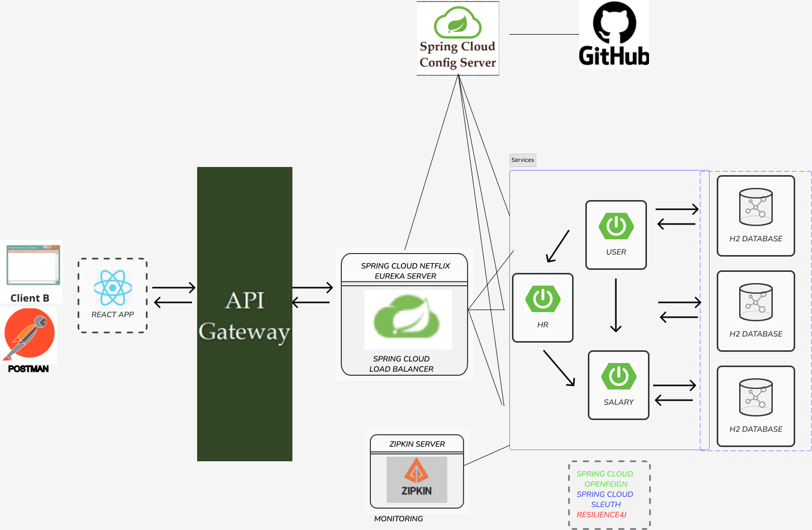
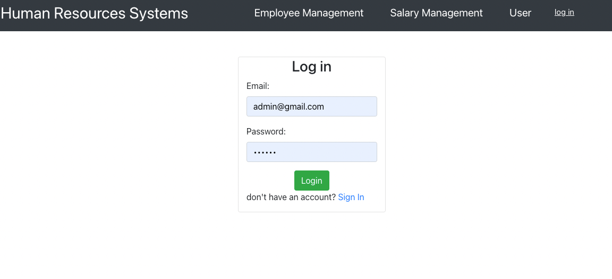
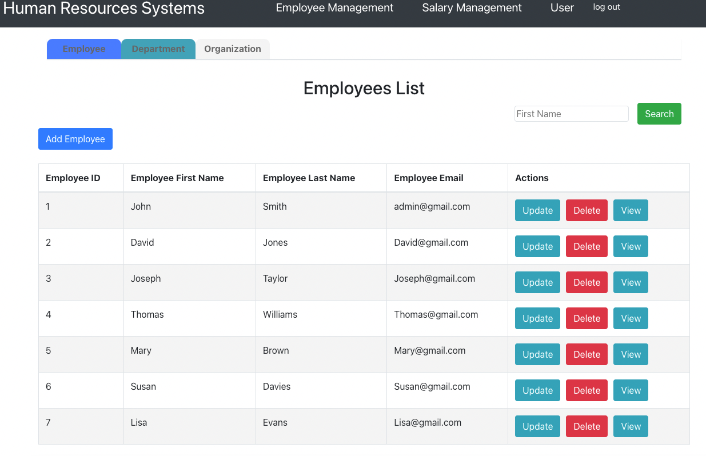

# Video
Architecture Video[architecture](https://drive.google.com/file/d/1y10ZdWjItVAnzWC8hqi5O5cdl221SERl/view?usp=sharing) 
Demo Video[demo](https://drive.google.com/file/d/1b6caDbK4_kTz51xVr1h77Jb3D7NL1KnN/view?usp=sharing) 


## Architecture


Our project consists of the following modules:
- **gateway-service** - a module that Spring Cloud Gateway for running Spring Boot application that acts as a proxy/gateway in our architecture.
- **config-service** - a module that uses Spring Cloud Config Server for running configuration server . The configuration files are placed on the github.
- **service-registry** - a module that depending on the example it uses Spring Cloud Netflix Eureka as an embedded discovery server.
- **employeeman-service** - a module containing the first of our sample microservices that allows to perform CRUD operation on employees
- **salary-service** - a module containing the second of our sample microservices that allows to perform CRUD operation on  salary-service. 
- **user-service** - a module containing the third of our sample microservices that allows to user to login and sign up. 
## Running the Back-end locally

### Running via docker-compose

First, go to the root of the repository:
```
cd distributed-project
```

Then you can pull the docker images and finally, run them:
```
docker-compose up
```

## The Client

A sample client (built with React.js) has been provided for testing purposes. 

### Running the sample client(Front-end)

You will need node package manager (npm) to install all dependencies and run the start scripts.

```
cd react-frontend
npm install
npm start
```
The frontend should be looking something like this, click login to and enter the following email and password:

```
admin@gmail.com 
123456
```
You should be able to see employee management service, salary management service and user service.
